<div align="center">

# Keyassay

### A ninety-day certificate is the wrong clock.

**Submit a hostname. Keyassay opens a real TLS connection to it, reads the certificate chain the
endpoint actually presents, pulls its Certificate Transparency history, and certifies how long the
traffic it has already sent stays unreadable to a quantum computer.**

[](#)
[](https://nextjs.org)
[](tsconfig.json)
[](https://tailwindcss.com)
[](#persistence)
[](#data-provenance)
[](https://crt.sh)
[](https://arxiv.org)
[](#agent-interface)
[](tests)
[](LICENSE)

[Live App](https://keyassay.vercel.app) ·
[GitHub](https://github.com/aniruddhaadak80/keyassay) ·
[API health](https://keyassay.vercel.app/api/health) ·
[Agent](https://keyassay.vercel.app/agent) ·
[Issues](https://github.com/aniruddhaadak80/keyassay/issues)

</div>

---

## The problem nobody writes down

Harvest-now-decrypt-later means every TLS session an adversary records today becomes readable the day
a cryptographically relevant quantum computer exists, if the key behind it has not been replaced by
then. The standard remedy — rotate the certificate — does nothing for traffic already captured. The
ciphertext is already in their hands.

So the question that matters is not when a certificate expires. It is **whether the key behind the
traffic you have already emitted will still be unbroken in 2040**, the year by which anything captured
today has to have become unreadable.

Keyassay answers that for a real endpoint, in about two seconds, with the arithmetic shown.

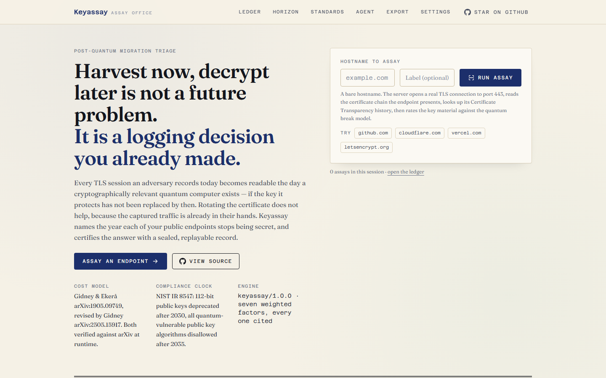

<table>
<tr>
<td width="50%">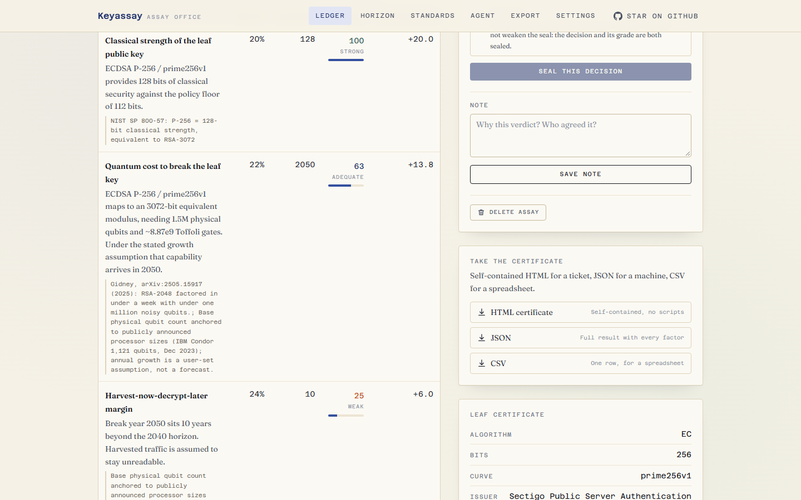</td>
<td width="50%">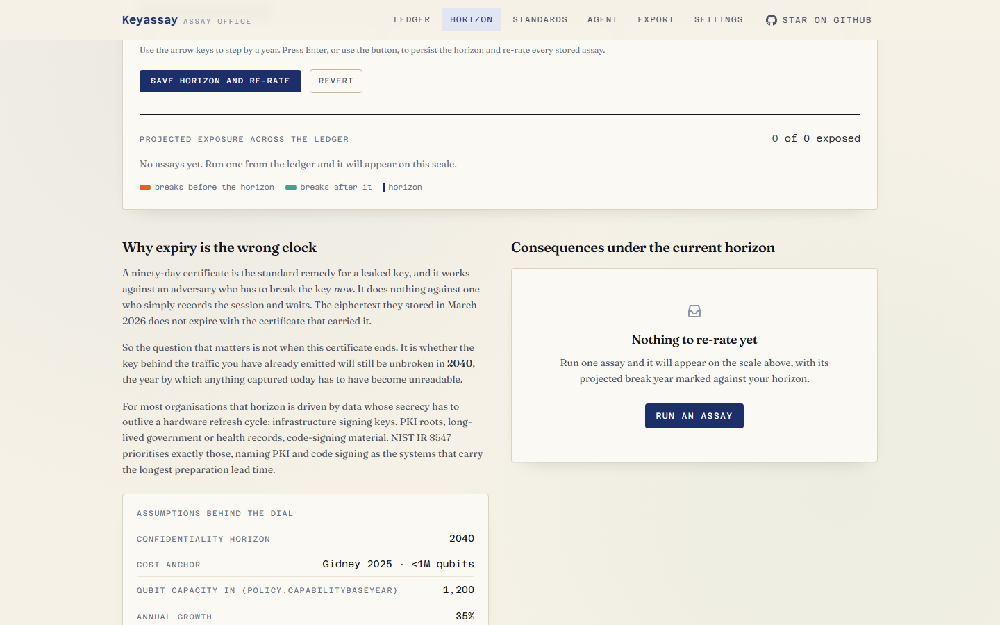</td>
</tr>
<tr>
<td align="center"><em>The certificate: seven weighted factors, every one cited.</em></td>
<td align="center"><em>Move the horizon; the ledger re-rates.</em></td>
</tr>
<tr>
<td>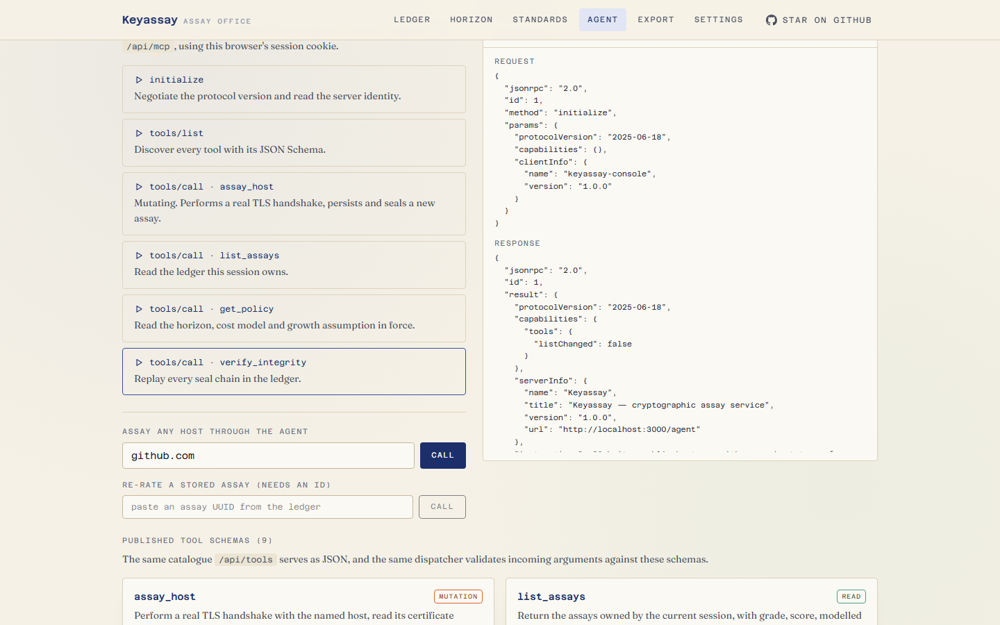</td>
<td>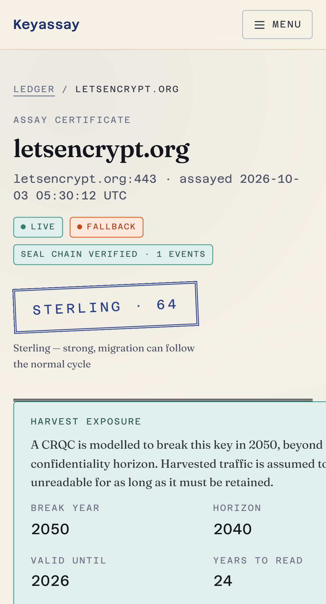</td>
</tr>
<tr>
<td align="center"><em>Nine MCP tools, live against the deployment.</em></td>
<td align="center"><em>The certificate on a phone.</em></td>
</tr>
</table>

Every screenshot above is the live deployment at [keyassay.vercel.app](https://keyassay.vercel.app), with a
real handshake against a real host. Regenerate them with `node scripts/capture-screenshots.mjs`.

| What you get | Why it matters |
| --- | --- |
| **A struck grade, not a risk band** | Bullion, sterling, base or corroded — the way an assayer certifies metal, with the mark and the reasoning on the certificate. |
| **Itemised factors with weights** | Seven factors, each with its measured value, its contribution and the published source it came from. The table's arithmetic reproduces exactly. |
| **The break year, and why you believe it** | Anchored to Gidney & Ekerå's circuit model and Gidney's 2025 revision, scaled by *your* stated qubit growth rate. Never presented as a prediction. |
| **A chain you can prove later** | Every mutation appends to a SHA-384 hash chain. Download the certificate, replay it in six months, and confirm the grade was never quietly edited. |
| **A migration order you can hand over** | Self-contained HTML for a ticket, JSON for a machine, CSV for a spreadsheet — all carrying the seal and every citation. |

---

## ✨ Features

- **A real handshake, not a lookup.** The server opens a TCP connection to port 443, performs the
  handshake, and walks the `issuerCertificate` chain the endpoint presents. If a host is down, the
  assay fails and says why.
- **Post-quantum detection that is honest.** Signature algorithm OIDs are read out of the certificate's
  DER, so an ML-DSA or SLH-DSA certificate is identified rather than guessed. When a key is already
  quantum-safe, the engine says "no break year applies" instead of inventing a distant one.
- **The horizon, not the expiry.** Exposure is measured against the year your data must stay secret.
  Drag the dial and every stored assay re-rates through the same engine.
- **Certificates verified against arXiv.** The two papers the cost model rests on are re-checked
  against the arXiv API at runtime, so a superseded citation shows up as a failed check instead of a
  confident-sounding string. Any other identifier can be checked the same way from `/standards`, so a
  citation can be audited rather than taken on trust.
- **Nine MCP tools over one service layer.** An agent's mutation runs the same code path as the button,
  including the real handshake and the same seal.
- **Tombstones, not erasures.** Deleting a record keeps its audit chain, so an auditor asking about an
  assay six months later finds the evidence rather than a hole.
- **Accessible by construction, and checked.** Every route is asserted for landmarks, a single `h1`, a
  gap-free heading outline, named controls, labelled fields, a working skip link and keyboard reachability
  of the primary action. That sweep is part of `npm run smoke`, so a regression fails CI rather than
  shipping.

---

## 🔌 Quickstart

```bash
git clone https://github.com/aniruddhaadak80/keyassay
cd keyassay
npm ci
npm run dev
```

Open <http://localhost:3000> and submit a hostname.

**Zero required environment variables.** With no configuration the repository adapter falls back to
an embedded PGlite instance — real Postgres compiled to WebAssembly — so the schema, check constraints,
partial unique indexes and transactions you exercise locally are the ones that run in production.

### Quality commands

| Command | What it does |
| --- | --- |
| `npm run typecheck` | `tsc --noEmit`, strict mode |
| `npm run lint` | ESLint flat config, no rule suppressions |
| `npm run test` | 99 unit and integration tests, no network needed |
| `npm run build` | Production build |
| `npm run smoke` | Playwright browser journey plus an accessibility sweep, desktop and mobile |
| `npm run verify:live` | Real HTTP proof against a deployed alias, 80 checks |

### Production environment variables

| Variable | Required | Purpose |
| --- | --- | --- |
| `DATABASE_URL` | **Yes in production** | Hosted Postgres connection string. A production build refuses to start without it rather than writing to volatile storage. |
| `NEXT_PUBLIC_SITE_URL` | No | Canonical origin for metadata, the sitemap and the agent manifest. Vercel injects it. |
| `DATABASE_SCHEMA` | No | Namespaces the tables on a shared instance. Must be a plain SQL identifier. |

`KEYASSAY_ALLOW_EMBEDDED` exists only so the local browser job can run a production-mode build against
the embedded adapter. It is never set in a real deployment, and the app logs a warning when it is.
Full list with comments in [`.env.example`](.env.example).

---

## 🏛️ System architecture

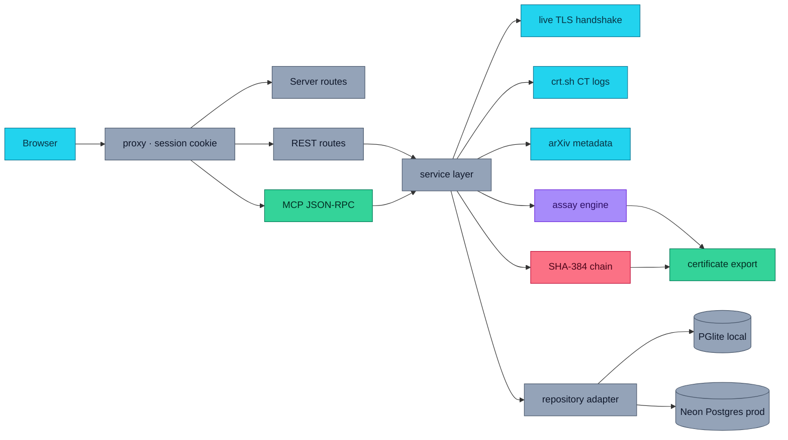

Two things matter here. Every route — page, REST and MCP — goes through **one service layer**, which
is what makes "the agent does what the UI does" a property of the code rather than a claim. And that
layer is the only place a mutation can append to the seal chain, so a route that forgets to seal
cannot be written.

---

## 🔑 Data pipeline and honest fallback

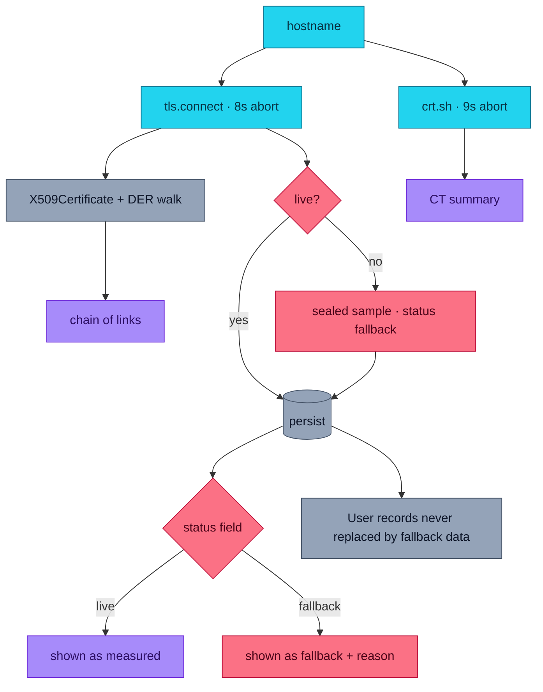

The handshake is authoritative. If it cannot run, the scan fails with a specific code
(`dns_failure`, `connection_refused`, `timeout`, `no_certificate`) instead of inventing a result. When
a caller explicitly accepts a sealed sample, that payload carries `status: "fallback"` and the reason,
and every surface renders it in amber. A fallback is never presented as a measurement.

arXiv gets particular care: it rate-limits by IP and does so lazily, sometimes taking half a minute to
reject a request. So the citation check aborts at six seconds, does not retry a `429`, memoises a
successful result for six hours, and streams into the page behind a Suspense boundary so the rest of
the page paints immediately either way.

---

## 🧮 The deterministic engine

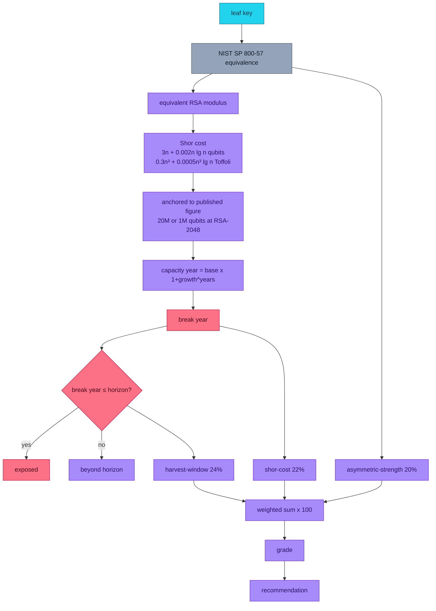

### The seven factors

| Factor | Weight | What it measures |
| --- | --- | --- |
| `harvest-window` | 24% | Years between the modelled break and your confidentiality horizon. Anchored so that landing exactly on the horizon scores 0.5 — a distant horizon can never make an exposed key look safe. |
| `shor-cost` | 22% | Hardware the break needs, mapped onto the NIST IR 8547 disallow clock. |
| `asymmetric-strength` | 20% | Classical strength of the leaf key against your configured floor. |
| `lifetime-compliance` | 12% | Whether the leaf's validity, and the organisation's CT issuance pattern, respect the 2030/2035 dates. |
| `chain-exposure` | 10% | How many issuing CA keys fall inside the horizon. Every CA key is a harvest target. |
| `protocol-cipher` | 6% | Negotiated TLS version and cipher suite. |
| `post-quantum-readiness` | 6% | Share of the chain already signed post-quantum. |

Weights sum to 1.0. The composite score is the weighted sum of each factor's normalised value, scaled
to 0–100, and **every contribution is derived from the rounded normalised value**, so the number a
reader multiplies out by hand is the number the product prints.

| Score | Grade | Meaning |
| --- | --- | --- |
| 80+ | **Bullion** | Quantum-resistant for the stated horizon. |
| 62–79 | **Sterling** | Strong; migration fits the normal replacement cycle. |
| 42–61 | **Base** | Exposed inside the planning horizon. |
| <42 | **Corroded** | Harvest-now-decrypt-later exposure is live. |

### Published constants versus risk assumptions

The engine deliberately separates two very different inputs.

**Published, and not configurable:** the Shor circuit formulas from Gidney & Ekerå
([arXiv:1905.09749](https://arxiv.org/abs/1905.09749)), the RSA-2048 physical-qubit anchors from that
paper and from Gidney's 2025 revision ([arXiv:2505.15917](https://arxiv.org/abs/2505.15917)), the NIST
SP 800-57 Part 1 Rev. 5 equivalences, and the NIST IR 8547 transition dates. Making these adjustable
would let a reader tune the model until it produced the answer they wanted.

**Yours, and always labelled as such:** the confidentiality horizon, the annual qubit growth rate, the
assumed current qubit capacity, and the classical security floor. Growth in particular is an
assumption, not a forecast, and the interface says so wherever it is used.

The one approximation, stated openly: an elliptic-curve key is mapped to the RSA modulus of equal
classical strength and evaluated with the RSA circuit model, because that is a documented and checkable
translation. The true elliptic-curve circuit has a different constant factor.

---

## 🔗 Integrity and seal replay

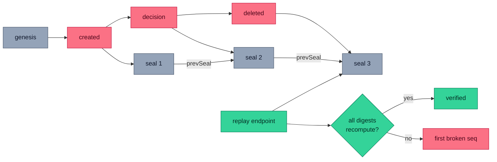

```
genesis     = "keyassay/genesis/1"
seal(n)     = SHA-384( UTF-8(seal(n-1)) || canonicalJson(event(n)) )
canonicalJson = object keys sorted recursively; array order preserved
```

Array order is preserved because array order *is* data. Non-finite numbers are rejected rather than
silently serialised as `null`. Editing any event invalidates every later digest, and removing an event
breaks the following event's recorded `prevSeal` — so a chain cannot be edited or truncated without
detection. `/verify` replays every chain in the session and reports the first broken link, and the
live verifier recomputes the chain independently of the application code as a second opinion.

Tombstones mean a deleted record still verifies. That is deliberate: an auditor asking about an assay
six months later should not find that the evidence vanished with the row.

---

## 🤖 Agent interface

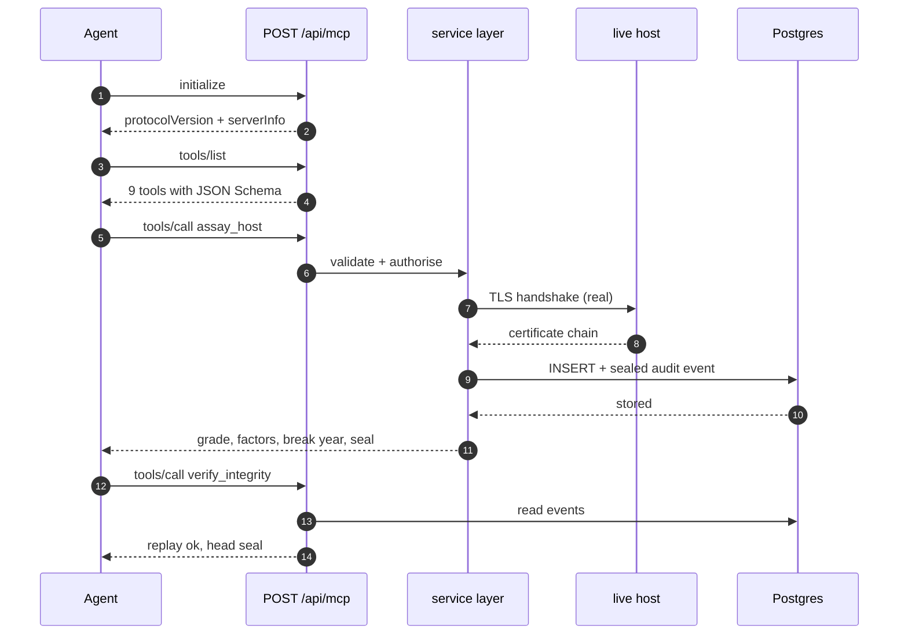

Nine tools over one service layer — three read, one analysis, three mutating, one policy, one export.
The same schemas are published three ways: in `tools/list`, at `/api/tools`, and in
[`public/mcp.json`](public/mcp.json).

```bash
curl -s https://keyassay.vercel.app/api/mcp \
  -H 'content-type: application/json' \
  -d '{"jsonrpc":"2.0","id":1,"method":"tools/call",
       "params":{"name":"assay_host","arguments":{"host":"github.com"}}}'
```

`assay_host` accepts an `idempotency_key`, so a retried call returns the original assay instead of
creating a second one. `delete_assay` requires `confirm: true` and refuses without it. Every operation is
scoped to the calling session's cookie, so an agent can never see or mutate another visitor's records.

---

## 👤 The user journey

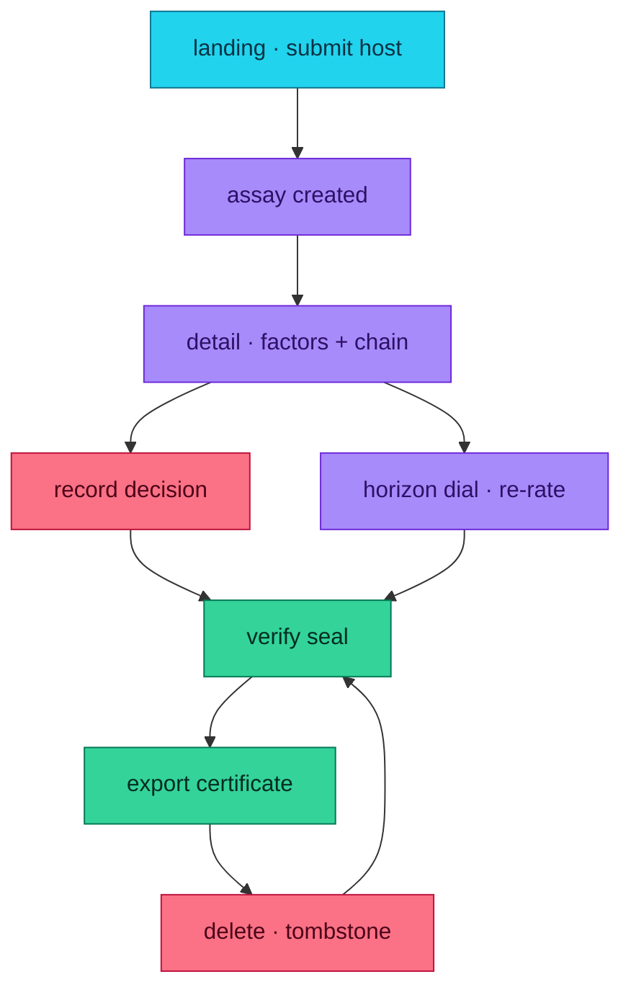

---

## 📁 Project map

### User routes

| Route | What it does |
| --- | --- |
| `/` | Landing. The assay form is above the fold; the grade legend explains what it returns; current PQC research streams in from arXiv. |
| `/ledger` | The workspace. Every assay, filter and sort in the URL, showing both the stored grade and the grade under the policy in force. |
| `/ledger/[id]` | One assay: the struck mark, itemised factors with citations, the full chain with per-link break years, CT provenance, decision control, export links. |
| `/horizon` | The signature interaction. Drag the confidentiality horizon and the whole ledger re-rates through the engine. |
| `/standards` | Every constant, with its citation, plus the live arXiv verification and the current literature. |
| `/agent` | The MCP console: preloaded `initialize`, `tools/list` and `tools/call`, with request and response shown verbatim, and the published tool schemas. |
| `/export` | Download the ledger as a JSON portfolio, a combined HTML dossier or CSV. |
| `/verify` | Replay one chain or every chain in the session; shows the first broken link if there is one. |
| `/settings` | The four risk assumptions, with a live preview of what changing them does to every stored grade. |

### API routes

| Route | Methods | Responsibility |
| --- | --- | --- |
| `/api/health` | `GET` | Runs `SELECT 1` through the real adapter and counts stored rows. Reports which store is live. |
| `/api/assays` | `GET` `POST` | List with filters and bounded pagination; create by performing a real handshake. |
| `/api/assays/[id]` | `GET` `PATCH` `DELETE` | Read one; update label, notes or decision; tombstone. |
| `/api/assays/[id]/verify` | `GET` | Replay one chain. |
| `/api/assays/[id]/certificate` | `GET` | Download the certificate as JSON, HTML or CSV. |
| `/api/engine` | `GET` `POST` | Break cost for one key, or a full live assay against a host. |
| `/api/policy` | `GET` `PATCH` | Read the risk position; persist changes and return the re-rated ledger. |
| `/api/standards` | `GET` `POST` | The cost model, plus live citation verification. |
| `/api/verify` | `GET` | Replay every chain in the session. |
| `/api/export` | `GET` | The whole ledger as one artifact. |
| `/api/tools` | `GET` | The tool catalogue as plain JSON. |
| `/api/mcp` | `GET` `POST` | MCP JSON-RPC 2.0: `initialize`, `tools/list`, `tools/call`, `ping`. |

### Key modules

| Path | Responsibility |
| --- | --- |
| `src/lib/engine/assay.ts` | The engine. One implementation used by the UI, the REST routes and the agent tools. |
| `src/lib/engine/constants.ts` | Published constants, each with its citation. |
| `src/lib/x509.ts` | A minimal DER reader, so the signature algorithm OID is read rather than guessed. |
| `src/lib/integrity/chain.ts` | Canonical JSON, the seal rule, and replay. |
| `src/lib/service.ts` | The single mutation path: scan, rate, persist, seal. |
| `src/lib/db/` | One typed repository interface; a `pg` adapter for production and PGlite for local. |
| `src/lib/sources/` | The three live sources, each with a labelled sealed fallback. |
| `src/lib/tools/` | Tool definitions, argument schemas and the dispatcher. |
| `scripts/verify-live.mjs` | The live verifier, including an independent chain recomputation. |

---

## 🔐 Persistence

| Environment | Adapter | Why |
| --- | --- | --- |
| Production | `pg` against a hosted Postgres | Survives redeploys and cold starts. `/api/health` reports `durable: true` and proves it by querying. |
| Local and tests | Embedded PGlite | Real Postgres in WebAssembly, zero configuration, same schema and constraints. |

A production build **refuses to start** without `DATABASE_URL` rather than falling back to volatile
storage, so a missing variable fails loudly instead of quietly losing writes. The one exception is
`KEYASSAY_ALLOW_EMBEDDED`, which exists solely so the local browser job can run a production-mode build;
the app logs a warning when it is set, and it is never set in a real deployment.

Ownership is an unguessable v4 UUID in an HTTP-only, SameSite=Lax cookie. `Secure` is derived from the
request's actual protocol rather than from `NODE_ENV`, because a production-mode server reached over
plain HTTP would otherwise set a cookie the client is required to discard — silently giving every
request a fresh, empty session.

---

## 🛡 Security and abuse controls

- **Input.** Hostnames are parsed, never interpolated. Schemes, paths, credentials and
  ports-in-host are rejected, which closes the obvious SSRF and URL-injection vectors. Strings and enums
  are length- and set-bounded; all SQL is parameterised.
- **Ownership.** Every query is scoped to the session. Another session's record returns `404`, not
  `403`, so its existence is never disclosed.
- **Rate limiting.** A per-process token bucket guards write routes. This is deliberately labelled
  best-effort: a serverless deployment scales horizontally and each container keeps its own bucket, so a
  deployment needing a hard limit should put a hosted rate limiter or WAF rule in front of `/api`.
- **Errors.** No stack trace, environment variable or driver message reaches a client. Unexpected
  failures return a generic message and are logged server-side.
- **Destructive operations.** `DELETE` is a tombstone that appends its own signed event; the MCP
  `delete_assay` tool additionally requires `confirm: true`.
- **No secrets anywhere.** No API keys, no credentials in client bundles, manifests, logs or
  screenshots. The product works with no account and no third-party service.

---

## ⚠️ Safety and honest limits

Keyassay reports what can be measured from a public TLS handshake and published cost estimates. It is
**not** a penetration test, an audit opinion, a compliance attestation, or a statement that a host is
secure. It cannot see implementation bugs, weak randomness, traffic analysis or operational mistakes.

Break years are **outputs of a stated growth assumption, not predictions**, and should never be quoted
as one. The ciphertext exposure it measures concerns traffic already captured: replacing a certificate
does not protect it. Verify independently before acting on any of this.

---

## 🗺️ Roadmap

### Now — shipped

- [x] Live TLS handshake with issuer-chain walk and DER-level post-quantum signature detection
- [x] Certificate Transparency history via crt.sh, with issuance-posture signals
- [x] Seven-factor explainable engine with published citations and live arXiv verification
- [x] Horizon dial that re-rates the persisted ledger through the same engine
- [x] Nine MCP tools over one service layer, with idempotent mutations
- [x] SHA-384 per-entity seal chain with replay, tombstones and a public verify route
- [x] Certificate export as HTML, JSON and CSV
- [x] Neon Postgres in production, embedded PGlite locally, same typed repository

### Next — not built

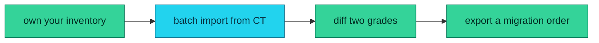

- [ ] **Own your inventory.** Register a domain and assay every certificate in its CT history, so a
      whole estate gets a grade instead of one hostname at a time.
- [ ] **Watch a host and diff the grades.** Re-assay on a schedule and show what changed, because a key
      that quietly downgrades is the failure nobody sees coming.
- [ ] **Diff two horizons.** Compare grades under different growth assumptions side by side, so a
      migration conversation can be about the assumption rather than the argument.
- [ ] **Emit a migration order.** A ranked worklist with the hybrid handshake configuration per
      endpoint, derived from the chain already in the certificate.

### Later — speculative

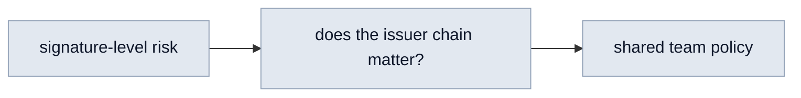

- [ ] **Signature-level rather than host-level risk**, if there is a public source good enough to trust.
- [ ] **Issuer-chain analysis**: how much of the exposure sits in certificates this host does not
      control, which is often the uncomfortable majority.
- [ ] **Shared policy for a team**, with per-member ownership and an audit log of who changed which
      assumption.

---

## 📄 Data and attribution

| Source | Used for | Terms |
| --- | --- | --- |
| The endpoint named by the visitor | The leaf certificate chain, protocol and cipher | Read-only, public, one handshake per scan |
| [crt.sh](https://crt.sh) | Certificate Transparency history | Public JSON, no key |
| [arXiv](https://arxiv.org) | Citation verification and current literature | Public API |
| [Gidney & Ekerå, arXiv:1905.09749](https://arxiv.org/abs/1905.09749) | Shor circuit cost model | Cited |
| [Gidney, arXiv:2505.15917](https://arxiv.org/abs/2505.15917) | Revised RSA-2048 physical-qubit estimate | Cited |
| NIST SP 800-57 Part 1 Rev. 5 | Security strength equivalences | Public standard |
| NIST IR 8547 (ipd) | Transition dates | Public standard |

Certificate Transparency records are public by design. Nothing is scraped that is not already published.

---

## 🤝 Contributing

See [CONTRIBUTING.md](CONTRIBUTING.md). The short version: cite every constant, keep published
constants separate from risk assumptions, never re-implement a calculation outside the engine, and
make sure failures report what they are.

## 🔐 Security

See [SECURITY.md](SECURITY.md). Please report vulnerabilities privately.

## 📄 License

[MIT](LICENSE) © 2026 aniruddhaadak80